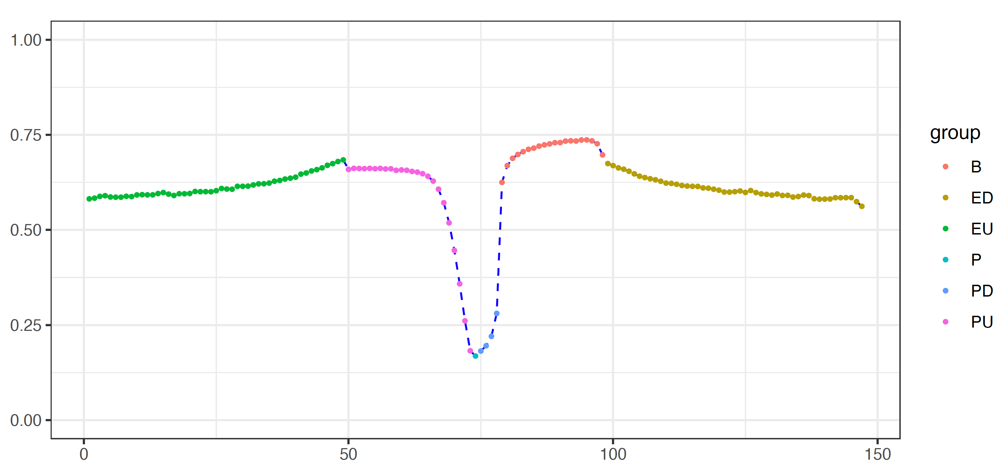

***

# Introduction
Here is a set of scripts for the for exploring regulatory potential of predefined regions.

## making windows regarding gene structures
```
usage: makeWindows.py [-h] -A ANNOTATION_FILE [-HWP WINDOW_PROMOTER] [-HWE WINDOW_ENHANCER] [-BN BIN_NUMBERS] [-C CUT_LENGTH] [-L MIN_LENGTH] -O OUTPUT_TAG

optional arguments:
  -h, --help            show this help message and exit
  -A ANNOTATION_FILE, --annotation_file ANNOTATION_FILE
                        Gene annotation file.
  -HWP WINDOW_PROMOTER, --window_promoter WINDOW_PROMOTER
                        Half window size for promoters [100].
  -HWE WINDOW_ENHANCER, --window_enhancer WINDOW_ENHANCER
                        Half window size for enhancers [10000].
  -BN BIN_NUMBERS, --bin_numbers BIN_NUMBERS
                        Number of bins for gene bodies [20].
  -C CUT_LENGTH, --cut_length CUT_LENGTH
                        Numober of bases to cut from gene bodies [1000].
  -L MIN_LENGTH, --min_length MIN_LENGTH
                        Minimal length of gene body [1000].
  -O OUTPUT_TAG, --output_tag OUTPUT_TAG
                        Prefix for output files.
```

The `ANNOTATION_FILE` is provided for human genome hg19 in the `out` folder. To run the script with default setting:
```
python makeWindows.py -A GeneAnnotation_Hg19.tsv -O hg19
```

The resulting file 'hg19_windows.bed' contains genomic intervals regarding gene structures for each gene:
```
chr1    68990   69190   ENSG00000186092_OR4F5_P_0
chr1    68790   68990   ENSG00000186092_OR4F5_PU_1
chr1    68590   68790   ENSG00000186092_OR4F5_PU_2
chr1    68390   68590   ENSG00000186092_OR4F5_PU_3
chr1    68190   68390   ENSG00000186092_OR4F5_PU_4
chr1    67990   68190   ENSG00000186092_OR4F5_PU_5
chr1    67790   67990   ENSG00000186092_OR4F5_PU_6
chr1    67590   67790   ENSG00000186092_OR4F5_PU_7
chr1    67390   67590   ENSG00000186092_OR4F5_PU_8
chr1    67190   67390   ENSG00000186092_OR4F5_PU_9
```
In the 4th column, the unique ID for each region was designed to contain `ENSEMBL` gene ID, gene symbol, feature and window number for each feature. There are 4 types of features, including distal upstream regions (EU), promoters (P, PU, PD), gene bodies (B) and distal downstream regions (ED).

## Calculating signals in each windows
This can be done using the `multiBigwigSummary` function in `deepTools`. Genome-wide signal such as DNA methylation should be stored in a `bigwig` file.

```
/sibcb/program/install/deeptools-3.2.1/bin/multiBigwigSummary BED-file \
  --BED hg19_windows.bed \
  -b esophagus_T_MM.bw \
  --outRawCounts esophagus_T_score.tsv \
  -o tmp.npz
```

The resulting file should cover all regions in window file but **reordered**.
```
#'chr'  'start' 'end'   'esophagus_T_MM.bw'
chr1    14090   34090   0.5711935773835404
chr1    34090   54090   0.726074748171194
chr1    64190   64390   nan
chr1    64390   64590   0.375
chr1    64590   64790   0.4534412920475006
chr1    64790   64990   0.35458168387413025
chr1    64990   65190   0.9166666865348816
chr1    65190   65390   nan
chr1    65390   65590   nan
```

## Summary analysis of genome-wide profile
```
Rscript getProfile.R -h
Options:
        --windowFile=WINDOWFILE
                Window file returned by makeWindows.

        --signalFile=SIGNALFILE
                Signal file generated by deepTools on regions defined in window_file.

        --BED=BED
                BED file of interest.

        --method=METHOD
                Summary method [mean, median].

        --outTag=OUTTAG
                Prefix for output files.

        -h, --help
                Show this help message and exit
```

The signal file was generated in the previous step.

```
Rscript getProfile.R --windowFile hg19_windows.bed \
  --signalFile esophagus_T_score.tsv \
  --outTag esophagus_T
```

## Plotting profiles
```
Rscript plotProfile.R -h
Options:
        --profile_file=PROFILE_FILE
                One profile file to be plotted.

        --sample_sheet=SAMPLE_SHEET
                A samplesheet to describe multiple profile files.

        --outTag=OUTTAG
                Prefix for output files.

        -h, --help
                Show this help message and exi
```

To plot one profile:
```
Rscript plotProfile.R --profile_file esophagus_T_profile.tsv --outTag esophagus_T
```


